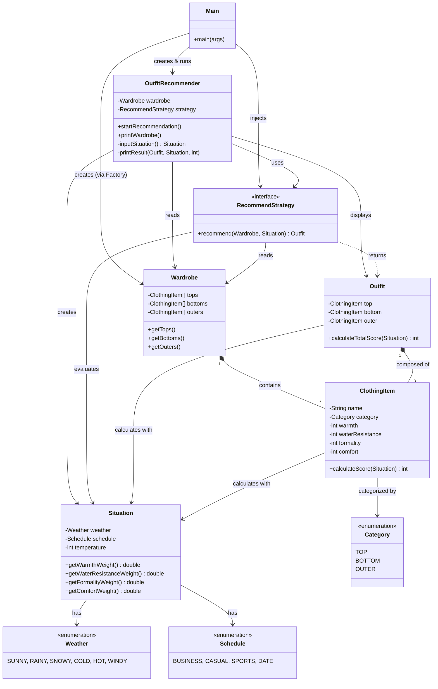

```mermaid
classDiagram
    direction TB

    class Main {
        +main(args)
    }

    class OutfitRecommender {
        -Wardrobe wardrobe
        -RecommendStrategy strategy
        +startRecommendation()
        +printWardrobe()
        -inputSituation() Situation
        -printResult(Outfit, Situation, int)
    }

    class RecommendStrategy {
        <<interface>>
        +recommend(Wardrobe, Situation) Outfit
    }

    class Wardrobe {
        -ClothingItem[] tops
        -ClothingItem[] bottoms
        -ClothingItem[] outers
        +getTops()
        +getBottoms()
        +getOuters()
    }

    class Outfit {
        -ClothingItem top
        -ClothingItem bottom
        -ClothingItem outer
        +calculateTotalScore(Situation) int
    }

    class ClothingItem {
        -String name
        -Category category
        -int warmth
        -int waterResistance
        -int formality
        -int comfort
        +calculateScore(Situation) int
    }

    class Situation {
        -Weather weather
        -Schedule schedule
        -int temperature
        +getWarmthWeight() double
        +getWaterResistanceWeight() double
        +getFormalityWeight() double
        +getComfortWeight() double
    }

    class Category {
        <<enumeration>>
        TOP
        BOTTOM
        OUTER
    }

    class Weather {
        <<enumeration>>
        SUNNY, RAINY, SNOWY, COLD, HOT, WINDY
    }

    class Schedule {
        <<enumeration>>
        BUSINESS, CASUAL, SPORTS, DATE
    }

    Main --> OutfitRecommender : creates & runs
    Main --> Wardrobe : creates (via Factory)
    Main --> RecommendStrategy : injects

    OutfitRecommender --> RecommendStrategy : uses
    OutfitRecommender --> Wardrobe : reads
    OutfitRecommender --> Situation : creates
    OutfitRecommender --> Outfit : displays

    RecommendStrategy --> Wardrobe : reads
    RecommendStrategy --> Situation : evaluates
    RecommendStrategy ..> Outfit : returns

    Wardrobe "1" *-- "*" ClothingItem : contains

    Outfit "1" *-- "3" ClothingItem : composed of
    Outfit --> Situation : calculates with

    ClothingItem --> Category : categorized by
    ClothingItem --> Situation : calculates with

    Situation --> Weather : has
    Situation --> Schedule : has
```
