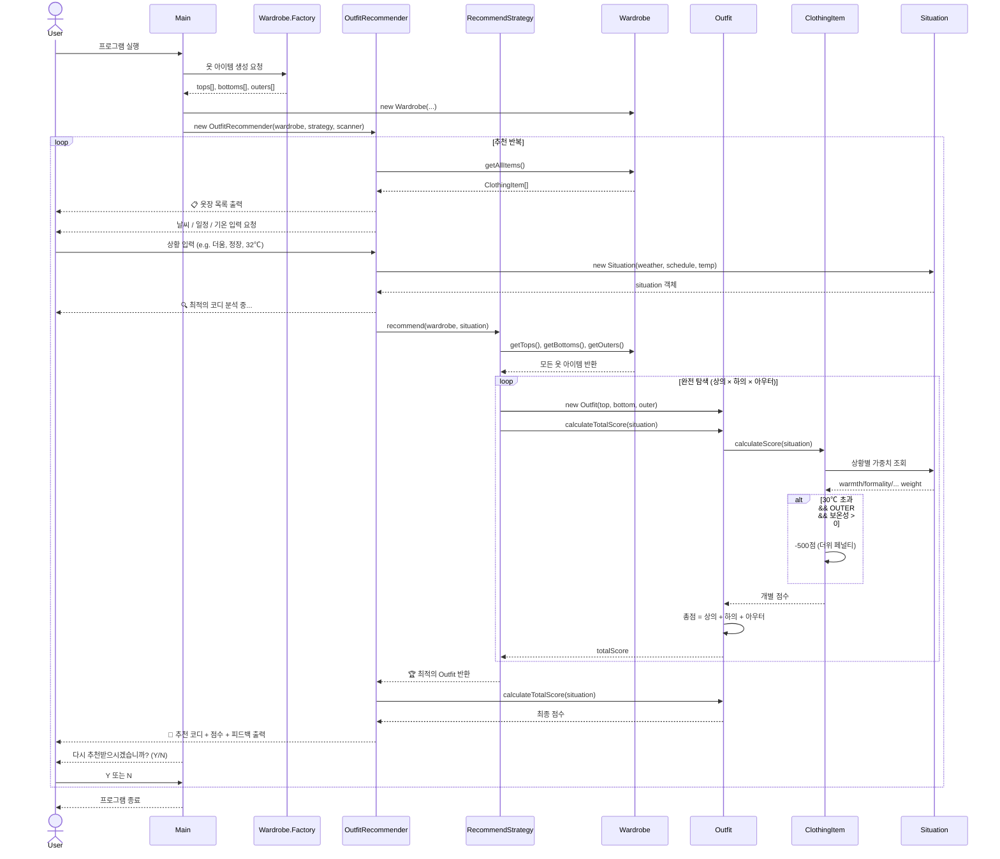

```mermaid
sequenceDiagram
    actor User
    participant Main
    participant Wardrobe.Factory
    participant OutfitRecommender
    participant RecommendStrategy
    participant Wardrobe
    participant Outfit
    participant ClothingItem
    participant Situation

    User->>Main: 프로그램 실행
    Main->>Wardrobe.Factory: 옷 아이템 생성 요청
    Wardrobe.Factory-->>Main: tops[], bottoms[], outers[]
    Main->>Wardrobe: new Wardrobe(...)
    Main->>OutfitRecommender: new OutfitRecommender(wardrobe, strategy, scanner)

    loop 추천 반복
        OutfitRecommender->>Wardrobe: getAllItems()
        Wardrobe-->>OutfitRecommender: ClothingItem[]
        OutfitRecommender-->>User: 📋 옷장 목록 출력

        OutfitRecommender-->>User: 날씨 / 일정 / 기온 입력 요청
        User->>OutfitRecommender: 상황 입력 (e.g. 더움, 정장, 32℃)
        OutfitRecommender->>Situation: new Situation(weather, schedule, temp)
        Situation-->>OutfitRecommender: situation 객체

        OutfitRecommender-->>User: 🔍 최적의 코디 분석 중...
        OutfitRecommender->>RecommendStrategy: recommend(wardrobe, situation)

        RecommendStrategy->>Wardrobe: getTops(), getBottoms(), getOuters()
        Wardrobe-->>RecommendStrategy: 모든 옷 아이템 반환

        loop 완전 탐색 (상의 × 하의 × 아우터)
            RecommendStrategy->>Outfit: new Outfit(top, bottom, outer)
            RecommendStrategy->>Outfit: calculateTotalScore(situation)

            Outfit->>ClothingItem: calculateScore(situation)
            ClothingItem->>Situation: 상황별 가중치 조회
            Situation-->>ClothingItem: warmth/formality/... weight
            alt 30℃ 초과 && OUTER && 보온성 > 0
                ClothingItem->>ClothingItem: -500점 (더위 페널티)
            end
            ClothingItem-->>Outfit: 개별 점수
            Outfit->>Outfit: 총점 = 상의 + 하의 + 아우터
            Outfit-->>RecommendStrategy: totalScore
        end

        RecommendStrategy-->>OutfitRecommender: 🏆 최적의 Outfit 반환
        OutfitRecommender->>Outfit: calculateTotalScore(situation)
        Outfit-->>OutfitRecommender: 최종 점수
        OutfitRecommender-->>User: 👔 추천 코디 + 점수 + 피드백 출력

        Main-->>User: 다시 추천받으시겠습니까? (Y/N)
        User->>Main: Y 또는 N
    end

    Main-->>User: 프로그램 종료
```
