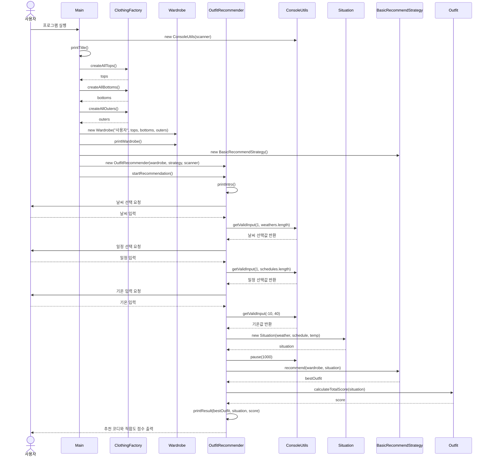

```mermaid
sequenceDiagram
    actor User as 사용자
    participant Main
    participant Factory as ClothingFactory
    participant Wardrobe
    participant Recommender as OutfitRecommender
    participant Console as ConsoleUtils
    participant Situation
    participant Strategy as BasicRecommendStrategy
    participant Outfit

    User->>Main: 프로그램 실행
    Main->>Console: new ConsoleUtils(scanner)
    Main->>Main: printTitle()

    Main->>Factory: createAllTops()
    Factory-->>Main: tops

    Main->>Factory: createAllBottoms()
    Factory-->>Main: bottoms

    Main->>Factory: createAllOuters()
    Factory-->>Main: outers

    Main->>Wardrobe: new Wardrobe("사용자", tops, bottoms, outers)
    Main->>Wardrobe: printWardrobe()

    Main->>Strategy: new BasicRecommendStrategy()
    Main->>Recommender: new OutfitRecommender(wardrobe, strategy, scanner)

    Main->>Recommender: startRecommendation()

    Recommender->>Recommender: printIntro()
    Recommender->>User: 날씨 선택 요청
    User-->>Recommender: 날씨 입력
    Recommender->>Console: getValidInput(1, weathers.length)
    Console-->>Recommender: 날씨 선택값 반환

    Recommender->>User: 일정 선택 요청
    User-->>Recommender: 일정 입력
    Recommender->>Console: getValidInput(1, schedules.length)
    Console-->>Recommender: 일정 선택값 반환

    Recommender->>User: 기온 입력 요청
    User-->>Recommender: 기온 입력
    Recommender->>Console: getValidInput(-10, 40)
    Console-->>Recommender: 기온값 반환

    Recommender->>Situation: new Situation(weather, schedule, temp)
    Situation-->>Recommender: situation

    Recommender->>Console: pause(1000)
    Recommender->>Strategy: recommend(wardrobe, situation)

    Strategy-->>Recommender: bestOutfit

    Recommender->>Outfit: calculateTotalScore(situation)
    Outfit-->>Recommender: score

    Recommender->>Recommender: printResult(bestOutfit, situation, score)
    Recommender-->>User: 추천 코디와 적합도 점수 출력
```